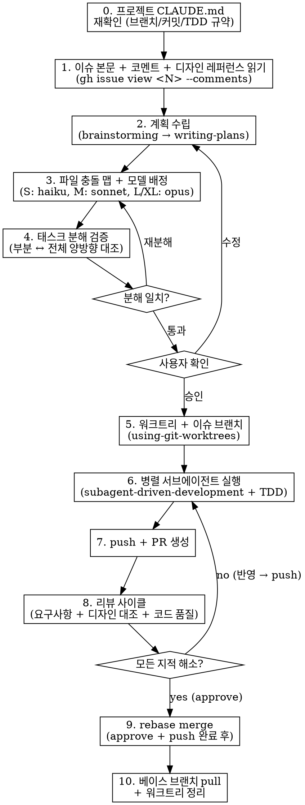

# Work Issue

GitHub 이슈를 받아 프로젝트 CLAUDE.md의 "서브에이전트 기반 병렬 작업 플로우" 순서로 끝까지 처리하는 엔트리포인트.

**Core principle:** 프로젝트 CLAUDE.md가 진짜 규약이다. 이 스킬은 그 규약을 끝까지 발동시키는 트리거다. CLAUDE.md에 없는 부분만 이 스킬이 보강한다.

## Workflow



## Steps

### 0. CLAUDE.md 재확인

프로젝트 루트의 `CLAUDE.md` (+ 상위 글로벌 `~/.claude/CLAUDE.md`) 읽어 규약 추출:

- 브랜치 네이밍 패턴
- 커밋 메시지 prefix 규약
- 베이스 브랜치 (develop/main 등)
- 테스트/빌드 명령
- Testing Philosophy (모킹 경계, 금지 패턴)
- 코딩 컨벤션

이후 모든 단계에서 여기서 추출한 규약을 기준으로 한다. **CLAUDE.md 규약이 이 스킬의 기본 기술과 상충하면 CLAUDE.md가 이긴다.**

### 1. 이슈 + 디자인 레퍼런스 읽기

```bash
gh issue view <N> --comments
```

다음을 **전부** 파악:
- 이슈 본문 요구사항
- 기존 코멘트(이전 분석·결정·리뷰 피드백)
- **디자인 레퍼런스** — 이슈에 첨부된 이미지/시안 링크, 참고 앱 화면, 참고 서비스(예: "구글 캘린더 참고")

디자인 이미지가 있으면 **다운로드해서 직접 본다** (예: `curl -sL <url> -o /tmp/<name>.png` 후 Read 툴로 열람). 이미지에서 읽을 수 있는 요소:
- 레이아웃 구조 (컬럼/영역/간격)
- 버튼·아이콘 배치와 종류
- 정보 배치 순서와 시각 계층
- 색상·타이포그래피·모서리·그림자

추출한 요구사항 + 디자인 요소를 **항목 체크리스트**로 정리해둔다 — 4단계 분해 검증과 8단계 리뷰에서 대조한다.

### 2. 계획 수립

- `superpowers:brainstorming` — 스코프/접근 합의
- `superpowers:writing-plans` — TDD 플랜 문서화

계획 문서 위치는 프로젝트 관례(예: `docs/superpowers/specs/`, `docs/superpowers/plans/`)를 따른다. 중요 결정은 이슈 코멘트로도 기록한다.

디자인 레퍼런스가 있으면 계획에 **"디자인 대조 항목"** 섹션을 포함한다 (레이아웃 구조, 필수 시각 요소, 인터랙션 패턴).

### 3. 파일 충돌 맵 + 모델 배정

각 서브태스크에 대해 표로 정리:

| Task | 주요 수정 파일 | 충돌 그룹 | 복잡도 | 모델 |
|------|----------------|----------|--------|------|
| 1 | ... | A (독립) | M | sonnet |
| 2 | ... | B (독립) | S | haiku |
| 3 | ... | A+B (공유) | L | opus |

- 독립 그룹은 병렬, 공유 그룹은 순차
- 복잡도: S = haiku, M = sonnet, L/XL = opus

사용자에게 보여주기 **전에** 4단계 분해 검증을 통과시킨다.

### 4. 태스크 분해 검증 (배정 전 양방향 대조)

사용자 승인 전에 자체 리뷰로 **태스크 분해가 계획을 정확히 투영하는지** 대조한다. 두 방향 모두 통과해야 승인 단계로 넘어간다.

**a. 부분 → 전체 (Faithfulness): 각 태스크가 계획의 해당 부분을 충실히 반영하는가**

- 태스크 서술이 2단계 계획 해당 섹션의 범위·동작·제약을 모두 포함하는가
- 축약·왜곡·누락으로 원 계획 의도가 변형되지 않았는가
- TDD 플로우, Testing Philosophy(모킹 경계, 금지 패턴), 커밋 분할 기준이 태스크 지시에 그대로 전달되는가
- 디자인 대조 항목이 해당 태스크 지시에 명시되는가 (시각/인터랙션 요소를 임의로 생략하지 않았는지)

**b. 전체 → 부분 (Completeness): 태스크들을 합치면 계획/요구사항 전체가 커버되는가**

- 1단계 요구사항 체크리스트의 **모든 항목**이 최소 하나 이상의 태스크에 매핑되는가
- 계획 문서의 섹션/단계가 모두 한 태스크에는 담겨 있는가
- 디자인 대조 항목 전부가 어느 태스크에도 빠지지 않았는가
- 경계 케이스(에러 처리, 접근 권한, 마이그레이션, 회귀 테스트 등)가 누락되지 않았는가
- 공통 셋업(워크트리, 의존성 설치, env 복사)이 어느 태스크의 책임인지 명확한가

**대조 표 예시:**

| 요구사항/계획 항목 | 담당 태스크 | 비고 |
|-------------------|------------|------|
| 요구사항 A-1 | Task 1 | |
| 요구사항 A-2 | Task 2, 3 | 공유 파일 — 순차 |
| 디자인 항목 D1 | Task 1 | |
| 디자인 항목 D2 | — | 🚨 누락 → 3단계로 돌아가 재분해 |
| 에러 처리 A-3 | Task 4 | |

**게이트 규칙:**
- 누락/왜곡/중복이 하나라도 있으면 **3단계로 돌아가 재분해**. 통과 전까지 사용자 승인 단계 진입 금지.
- 검증 결과(대조 표)를 사용자 승인 요청 때 **함께** 제시한다 — "이 태스크들로 쪼갰고, 체크리스트 전 항목이 이렇게 매핑됩니다"를 근거로 보여줘야 사용자가 승인 여부를 판단할 수 있다.

### 5. 워크트리

`superpowers:using-git-worktrees` 호출. 베이스는 **최신 베이스 브랜치**. 브랜치명은 CLAUDE.md 규약.

```bash
git fetch origin
git worktree add <경로> -b <브랜치명> origin/<base-branch>
cd <경로>
# 프로젝트 setup (npm install, pip install, 등)
# .env.local 등 gitignore된 필수 파일 복사
# 베이스라인 테스트 실행
```

### 6. 병렬 서브에이전트 실행

`superpowers:subagent-driven-development`로 독립 태스크 병렬 실행. 각 에이전트는:

- `superpowers:test-driven-development` 엄수: **테스트 작성 → 실패 확인 → 구현 → 통과 → 커밋**
- 커밋은 CLAUDE.md prefix 규약 (예: `#N feat(scope): ...`)
- **각 커밋이 단독으로 빌드/테스트 통과**
- 한 뭉태기 커밋 금지 — 논리 단위별 분할
- 테스트와 구현은 **같은 커밋**

공유 그룹(같은 파일 수정)은 순차. 병렬 안전성은 충돌 맵 기준.

### 7. PR 생성

모든 태스크 완료 + 로컬 전체 테스트 + (UI 변경 시) E2E 통과 후:

```bash
git push -u origin <브랜치명>
gh pr create --base <base-branch> --title "<이슈번호> 제목" --body "..."
```

PR body에 포함:
- `closes #<N>` (자동 close)
- 이슈 요구사항별 해결 방식 요약
- 디자인 레퍼런스가 있었다면 **디자인 대조 결과** (스크린샷 첨부)
- 테스트 계획 (체크박스)

### 8. 리뷰 사이클

**지적사항이 모두 해소될 때까지 반복**:

**a. 리뷰 에이전트 — 3중 대조**

1. **이슈 요구사항 대조**
   - `gh issue view <N>`로 본문 + 코멘트 재확인
   - PR diff와 **항목별 대조**, 누락은 🔴 필수수정

2. **디자인 대조** (디자인 레퍼런스가 이슈에 있는 경우 **필수**)
   - 이미지/시안을 다시 열어 구현 결과(스크린샷/실행 화면)와 비교
   - 점검 항목:
     - 레이아웃 구조가 일치하는가 (컬럼/영역/간격 비율)
     - 버튼·아이콘의 종류와 배치가 맞는가
     - 정보의 배치 순서와 시각 계층(크기/굵기/색)이 맞는가
     - 색상·타이포그래피·모서리·그림자 톤이 맞는가
     - 인터랙션 패턴(호버, 포커스, 애니메이션)이 의도대로인가
     - 반응형 거동(모바일/데스크톱)이 시안 의도와 어긋나지 않는가
   - 미스매치는 🔴 필수수정. 시안에 명시되지 않은 애매한 부분은 **추측 금지 → 사용자에게 반문**

3. **코드 품질 대조**
   - 아키텍처(의존성 방향, 레이어 분리)
   - 안전성(에러 처리, 경계값, 401/권한)
   - 테스트 커버리지 (신규 동작 + 회귀)
   - CLAUDE.md 금지 패턴(호출 횟수 검증, 내부 상태 검증 등) 위반 여부

**인라인 코멘트**로 해당 라인에 직접 지적 (한 PR 코멘트에 몰아쓰기 금지).

**b. 구현 에이전트**
- 🔴 필수수정은 반드시 반영
- 🟡 권장은 판단 — 기존 코드 의도와 충돌하면 반문
- 추가 단계적 커밋 + push

**c. 재리뷰**
- 이전 지적 해소 확인 + 신규 문제 점검
- 3중 대조(요구사항 / 디자인 / 품질)를 **모두** 다시 통과해야 approve

### 9. 머지

**반드시 approve + push 완료 상태**에서 실행. 머지 후 push 금지.

```bash
gh pr merge <N> --rebase --delete-branch
```

### 10. 동기화 및 정리

```bash
cd <메인 체크아웃>
git checkout <base-branch>
git pull --rebase origin <base-branch>
git worktree remove <워크트리 경로>
```

다음 태스크는 **최신 base-branch 기반으로 새 워크트리/브랜치**부터 시작.

## Red Flags

| 증상 / 생각 | 실제 의미 |
|-------------|-----------|
| "CLAUDE.md 규약이 명시 안 된 부분은 내 판단으로" | 0단계에서 놓친 섹션이 있다. 다시 읽어라 |
| "이슈 본문만 봐도 요구사항은 알 수 있다" | 코멘트에 결정·피드백이 있다. `--comments` 필수 |
| "디자인 이미지는 대충 보면 감온다" | 다운로드해서 직접 열람. 항목 체크리스트 없이는 리뷰 대조 불가 |
| "디자인 대조는 구현 완료 후에 한 번 보면 된다" | 8단계 리뷰에서 **재리뷰마다** 통과해야 한다. "나중에"는 approve 게이트를 틀리는 것 |
| "시안에 명시 안 된 세부는 내가 판단" | 추측 금지. 애매하면 사용자에게 반문 |
| "파일 충돌 맵은 생략해도 감으로 병렬 가능" | 3단계 건너뛰면 병렬 중 머지 충돌 폭발 |
| "태스크 쪼갰으면 바로 사용자 승인 요청" | 4단계 분해 검증 누락. 부분→전체 / 전체→부분 대조 표 없이는 요구사항 구멍이 보이지 않는다 |
| "요구사항 체크리스트 항목 대부분 커버됐으니 됐다" | "대부분"은 커버리지가 아니다. 1단계 체크리스트의 **모든 항목**이 어느 태스크에 매핑됐는지 명시적으로 대조 |
| "태스크 지시에 계획 요점만 축약해 전달" | 축약 과정에서 제약·테스트 요구사항이 손실된다. 계획 해당 섹션을 태스크 지시에 **원문에 가깝게** 전달 |
| "순차가 안전하니 전부 순차로" | 충돌 맵 → 독립 그룹은 병렬. 전부 순차는 무의미 |
| "리뷰 한 번이면 충분" | 8단계는 **루프**. approve까지 간 적 없으면 반복 중 |
| "머지 후에 리뷰 반영" | 금지. 9단계는 approve + push 완료 후에만 |
| "개별 테스트만 돌려도 OK" | 각 커밋이 **단독 빌드/테스트 통과** 원칙 위배 |
| "테스트는 구현 후에 몰아서" | TDD 위배. 테스트 먼저 → 실패 확인 → 구현 |
| "merge commit이 더 이력 명확" | CLAUDE.md가 rebase merge 명시했다면 위배 |

## Key References

- `superpowers:brainstorming` — 스코프/접근 합의
- `superpowers:writing-plans` — 구현 계획 문서
- `superpowers:using-git-worktrees` — 워크트리 생성
- `superpowers:subagent-driven-development` — 병렬 실행
- `superpowers:test-driven-development` — TDD 사이클
- `superpowers:verification-before-completion` — 완료 주장 전 증거 확보
- `superpowers:requesting-code-review` — 리뷰 요청
- `superpowers:finishing-a-development-branch` — 머지 결정

## Invocation

사용자 발화 예시:
- `/work-issue 58`
- `이슈 #58 처리해줘`
- `이 이슈 처리해줘 https://github.com/owner/repo/issues/58`
- `#58 작업 시작`

이슈 번호를 추출한 뒤 **0단계부터 순차 진행**. 사용자가 중간 단계만 원한다고 하면 해당 지점부터 시작하되, 이전 단계의 결과물(계획 문서, 워크트리 등)이 존재하는지 확인.
